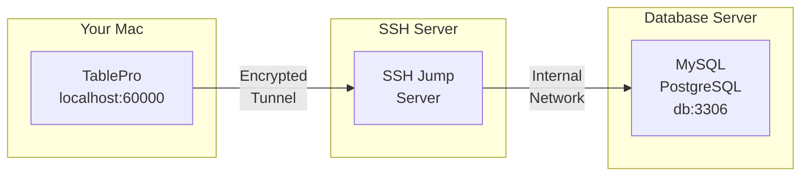
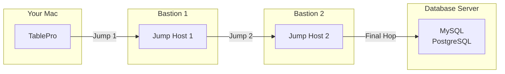

# SSH Tunneling

SSH tunneling định tuyến kết nối database qua tunnel mã hóa để truy cập server không truy cập trực tiếp từ Mac. TablePro quản lý vòng đời tunnel, bao gồm keep-alive và tự kết nối lại.

<Tip>
Nếu bạn kết nối nhiều database qua cùng SSH server, bạn có thể lưu cấu hình SSH thành profile tái sử dụng. Xem [SSH Profiles](/vi/features/ssh-profiles).
</Tip>

## Cách SSH Tunneling Hoạt động



1. TablePro mở kết nối SSH đến jump server
2. Cổng local (ví dụ: 60000) chuyển tiếp qua tunnel
3. Mọi traffic giữa Mac và SSH server đều mã hóa
4. SSH server kết nối đến database thay bạn

## Khi Nào Dùng SSH Tunneling

- Database server nằm trong mạng nội bộ
- Database server chỉ chấp nhận kết nối local
- Cần mã hóa kết nối database
- Truy cập database qua bastion/jump host

## Thiết lập SSH Tunneling

<Steps>
  <Step title="Tạo hoặc Sửa Kết nối">
    Mở form kết nối cho database
  </Step>
  <Step title="Bật SSH Tunnel">
    Bật công tắc **SSH Tunnel**
  </Step>
  <Step title="Cấu hình SSH">
    Nhập thông tin SSH server và xác thực
  </Step>
  <Step title="Kiểm tra và Kết nối">
    Nhấp **Test Connection** để xác minh tunnel hoạt động
  </Step>
</Steps>

{/* Screenshot: Connection form with SSH section expanded */}
<Frame caption="Cấu hình SSH tunnel">
  
  
</Frame>

## Tùy chọn Cấu hình SSH

### SSH Server

| Trường | Mô tả | Mặc định |
|-------|-------------|---------|
| **SSH Host** | Hostname hoặc IP của SSH server | - |
| **SSH Port** | Cổng SSH server | `22` |
| **SSH User** | Tên người dùng SSH | - |

### Phương thức Xác thực

TablePro hỗ trợ ba phương thức:

<Tabs>
  <Tab title="Password">
    Xác thực mật khẩu:

    | Trường | Mô tả |
    |-------|-------------|
    | **SSH Pass** | Mật khẩu SSH |

    <Warning>
    Xác thực mật khẩu kém an toàn hơn key. Dùng SSH key cho server production.
    </Warning>
  </Tab>
  <Tab title="Private Key">
    Xác thực bằng key (an toàn hơn):

    | Trường | Mô tả |
    |-------|-------------|
    | **Key File** | Đường dẫn private key (ví dụ: `~/.ssh/id_rsa`) |
    | **Passphrase** | Passphrase của key (nếu mã hóa) |

    <Tip>
    Nhấp **Browse** để chọn file private key. TablePro tìm trong `~/.ssh/` mặc định.
    </Tip>
  </Tab>
  <Tab title="SSH Agent">
    Ủy quyền ký cho tiến trình SSH agent (1Password, Secretive, macOS `ssh-agent`). Key nằm trong agent, TablePro không đọc trực tiếp.

    | Trường | Mô tả |
    |-------|-------------|
    | **Agent Socket** | Dropdown gồm `SSH_AUTH_SOCK`, `1Password`, hoặc `Custom Path` |

    - **SSH_AUTH_SOCK**: Dùng biến môi trường `SSH_AUTH_SOCK` của hệ thống.
    - **1Password**: Dùng đường dẫn socket mặc định của 1Password, `~/Library/Group Containers/2BUA8C4S2C.com.1password/t/agent.sock`.
    - **Custom Path**: Hiện ô nhập để bạn điền đường dẫn socket khác.

    <Tip>
    1Password cũng ghi `~/.1password/agent.sock` là alias dễ gõ hơn, nhưng shortcut này chỉ hoạt động nếu bạn tự tạo. Tùy chọn **1Password** trong TablePro dùng đường dẫn mặc định trong `~/Library/Group Containers/...`.
    </Tip>
  </Tab>
</Tabs>

{/* Screenshot: Phương thức xác thực SSH */}
<Frame caption="Xác thực SSH: Password và Private Key">
  
  
</Frame>

### Xác thực Hai yếu tố (TOTP)

Nếu SSH server yêu cầu xác thực hai yếu tố qua PAM (ví dụ: `google-authenticator`, `duo_unix`), TablePro có thể xử lý mã TOTP (Time-based One-Time Password) khi đăng nhập.

Tùy chọn TOTP xuất hiện trong phần **Two-Factor Authentication** khi bạn chọn **Password** hoặc **Keyboard Interactive** làm phương thức xác thực.

<Tabs>
  <Tab title="Auto Generate">
    TablePro tự tạo mã TOTP khi kết nối bằng secret bạn cung cấp. Không cần mở ứng dụng authenticator.

    | Trường | Mô tả |
    |-------|-------------|
    | **TOTP Secret** | Secret dạng base32 (cùng key bạn dùng khi thiết lập authenticator) |
    | **Algorithm** | Thuật toán hash: SHA1 (mặc định), SHA256, hoặc SHA512 |
    | **Digits** | Độ dài mã: 6 (mặc định) hoặc 8 |
    | **Period** | Chu kỳ xoay mã: 30 giây (mặc định) hoặc 60 giây |

    <Tip>
    TOTP secret là chuỗi base32 bạn nhận khi đăng ký 2FA lần đầu. Nếu chỉ có mã QR, hầu hết authenticator app cho phép xem secret bên dưới.
    </Tip>
  </Tab>
  <Tab title="Prompt at Connect">
    TablePro hiện hộp thoại yêu cầu mã xác thực mỗi lần kết nối. Dùng chế độ này nếu bạn muốn nhập mã từ authenticator app thủ công.

    Không cần cấu hình thêm. Chọn chế độ này và TablePro sẽ hỏi mã khi cần.
  </Tab>
</Tabs>

**Các bước thiết lập:**

1. Trong tab SSH của cài đặt kết nối, chọn **Password** hoặc **Keyboard Interactive** làm phương thức xác thực
2. Trong phần **Two-Factor Authentication**, chọn chế độ TOTP
3. Với Auto Generate: dán TOTP secret dạng base32

TOTP tương thích với các cấu hình PAM phổ biến gồm `google-authenticator`, `duo_unix`, và các module tương tự.

### Xác minh Host Key

TablePro xác minh host key SSH để bảo vệ chống tấn công man-in-the-middle. Khi kết nối lần đầu đến server, bạn sẽ thấy fingerprint của server và có thể chọn tin tưởng. Key sau đó được lưu local.

Nếu host key của server đã tin tưởng thay đổi, TablePro hiển thị cảnh báo. Có thể server đã cài lại, hoặc có vấn đề bảo mật. Bạn có thể chấp nhận key mới hoặc hủy kết nối.

### Dùng SSH Config

Nếu có entry trong `~/.ssh/config`, TablePro đọc tự động:

1. TablePro đọc SSH config khi khởi động
2. Chọn host từ dropdown **SSH Host**
3. Các thiết lập tự động điền từ config

Ví dụ SSH config:

```
# ~/.ssh/config
Host production-jump
    HostName jump.example.com
    User deploy
    Port 22
    IdentityFile ~/.ssh/production_key
```

Hiển thị "production-jump" trong dropdown SSH Host.

{/* Screenshot: SSH host từ config */}
<Frame caption="SSH hosts từ ~/.ssh/config">
  
  
</Frame>

## Cài đặt Kết nối Database

Khi dùng SSH tunneling, database host tính tương đối so với SSH server:

| Trường | Giá trị | Mô tả |
|-------|-------|-------------|
| **Host** | `localhost` hoặc `127.0.0.1` | Database trên SSH server |
| **Host** | `db.internal` | Database trên mạng nội bộ |
| **Port** | `3306`, `5432`, v.v. | Cổng database (không đổi) |

<Note>
Database host là giá trị SSH server dùng để đến database, không phải giá trị Mac dùng.
</Note>

### Các Trường hợp Phổ biến

#### Database trên SSH Server

Database chạy cùng máy SSH server:

```
SSH Host:       jump.example.com
SSH User:       deploy

Database Host:  localhost
Database Port:  3306
```

#### Database trên Mạng Nội bộ

Database ở server khác, chỉ truy cập được từ SSH server:

```
SSH Host:       jump.example.com
SSH User:       deploy

Database Host:  db.internal.example.com
Database Port:  5432
```

#### AWS RDS qua Bastion

Kết nối RDS qua EC2 bastion host:

```
SSH Host:       bastion.example.com
SSH User:       ec2-user
Key File:       ~/.ssh/aws-key.pem

Database Host:  mydb.abc123.us-east-1.rds.amazonaws.com
Database Port:  5432
```

## Multi-Jump SSH (ProxyJump)

Khi database server nằm sau nhiều bastion host, TablePro có thể nối chuỗi các bước nhảy SSH bằng cờ `-J` (ProxyJump) của OpenSSH. Một tiến trình `ssh` duy nhất xử lý tất cả các hop trung gian.



### Thiết lập Multi-Jump

1. Mở form kết nối và chuyển sang tab **SSH Tunnel**
2. Bật SSH và cấu hình **SSH server cuối cùng** (server có thể truy cập database)
3. Mở rộng phần **Jump Hosts** bên dưới cài đặt xác thực
4. Nhấp **Add Jump Host** và điền thông tin từng bastion host trung gian theo thứ tự
5. Các host được kết nối tuần tự: jump host đầu tiên được truy cập từ Mac, mỗi host tiếp theo được truy cập qua host trước đó

### Cài đặt Jump Host

Mỗi jump host có:

| Trường | Mô tả |
|-------|-------------|
| **Host** | Hostname hoặc IP của jump host |
| **Port** | Cổng SSH (mặc định `22`) |
| **Username** | Tên người dùng SSH cho hop này |
| **Auth Method** | **Private Key** hoặc **SSH Agent** (không hỗ trợ password cho jump host) |
| **Key File** | Đường dẫn private key (nếu dùng Private Key) |

### Ví dụ: Hai Bastion Host

```
Jump Host 1:    admin@bastion1.example.com:22    (SSH Agent)
Jump Host 2:    tunnel@bastion2.internal:2222     (Private Key)

SSH Server:     deploy@final-ssh.internal:22
Database Host:  db.internal:5432
```

Tương đương lệnh:
```bash
ssh -J admin@bastion1.example.com:22,tunnel@bastion2.internal:2222 deploy@final-ssh.internal
```

### Tích hợp SSH Config

TablePro đọc directive `ProxyJump` từ `~/.ssh/config`. Khi chọn config host có `ProxyJump`, các jump host tự động được điền.

```
# ~/.ssh/config
Host production-db
    HostName final-ssh.internal
    User deploy
    ProxyJump admin@bastion1.example.com,tunnel@bastion2.internal:2222
```

<Note>
Jump host chỉ hỗ trợ xác thực **Private Key** và **SSH Agent**. Xác thực password không khả dụng cho các hop trung gian vì cờ `-J` của OpenSSH không hỗ trợ nhập password tương tác cho jump host.
</Note>

## Thiết lập SSH Key

### Tạo SSH Key

Nếu chưa có:

```bash
# Tạo key pair mới
ssh-keygen -t ed25519 -C "your_email@example.com"

# Hoặc RSA cho tương thích rộng hơn
ssh-keygen -t rsa -b 4096 -C "your_email@example.com"
```

### Vị trí Key

Vị trí mặc định trên macOS:

| Loại Key | Private Key | Public Key |
|----------|-------------|------------|
| Ed25519 | `~/.ssh/id_ed25519` | `~/.ssh/id_ed25519.pub` |
| RSA | `~/.ssh/id_rsa` | `~/.ssh/id_rsa.pub` |
| ECDSA | `~/.ssh/id_ecdsa` | `~/.ssh/id_ecdsa.pub` |

### Thêm Key vào Server

Copy public key đến SSH server:

```bash
# Dùng ssh-copy-id
ssh-copy-id -i ~/.ssh/id_ed25519.pub user@server

# Hoặc thủ công
cat ~/.ssh/id_ed25519.pub | ssh user@server "mkdir -p ~/.ssh && cat >> ~/.ssh/authorized_keys"
```

### Quyền Key

SSH key phải có quyền chính xác:

```bash
# Sửa quyền
chmod 700 ~/.ssh
chmod 600 ~/.ssh/id_*
chmod 644 ~/.ssh/id_*.pub
chmod 644 ~/.ssh/config
```

## Nhập từ URL

Import kết nối SSH tunnel từ URL thay vì điền từng trường. TablePro hỗ trợ scheme `+ssh` gộp cả SSH và database trong một chuỗi.

Xem [Tham chiếu URL kết nối](/databases/connection-urls#ssh-tunnel-format) để biết đầy đủ thông số.

**Định dạng:**

```
scheme+ssh://ssh_user@ssh_host:ssh_port/db_user:db_password@db_host/db_name?name=MyConnection&usePrivateKey=true
```

**Scheme hỗ trợ:** `mysql+ssh`, `postgresql+ssh`, `postgres+ssh`, `mariadb+ssh`

**Ví dụ:**

```
mysql+ssh://root@123.123.123.123:1234/database_user:database_password@127.0.0.1/database_name?name=FlashPanel&usePrivateKey=true
```

Kết quả:
- **SSH Host**: `123.123.123.123`, **SSH Port**: `1234`, **SSH User**: `root`
- **Database Host**: `127.0.0.1`, **Database User**: `database_user`, **Database**: `database_name`
- **Tên kết nối**: `FlashPanel`, **Xác thực**: Private Key

**Query parameter:**

| Parameter | Mô tả |
|-----------|-------------|
| `name` | Đặt tên kết nối |
| `usePrivateKey` | `true` để chọn xác thực Private Key |
| `useSSHAgent` | `true` để chọn xác thực SSH Agent |
| `agentSocket` | Đường dẫn socket SSH agent ghi đè (ví dụ: `~/Library/Group Containers/2BUA8C4S2C.com.1password/t/agent.sock`) |

Import: mở **New Connection**, nhấp **Import from URL**, dán URL.

<Tip>
Format này tương thích URL SSH của TablePlus, dán trực tiếp khi migrate.
</Tip>

## Khắc phục Sự cố

### Từ chối Kết nối

**Triệu chứng**: "Connection refused" khi test SSH tunnel

**Nguyên nhân và Giải pháp**:

1. **SSH server không chạy**
   ```bash
   # Test SSH trực tiếp
   ssh -v user@server
   ```

2. **Sai cổng**
   - Kiểm tra cổng SSH (có server dùng cổng khác 22)
   - Hỏi quản trị viên server

3. **Firewall chặn**
   - Đảm bảo cổng 22 (hoặc cổng tùy chỉnh) mở
   - Kiểm tra firewall cả hai phía

### Xác thực Thất bại

**Triệu chứng**: "SSH authentication failed" hoặc "Permission denied"

**Cho xác thực mật khẩu**:
1. Kiểm tra username và password
2. Kiểm tra password auth có bật trên server
3. Thử qua terminal: `ssh user@server`

**Cho xác thực key**:
1. Kiểm tra đường dẫn key đúng
2. Kiểm tra quyền key (`chmod 600`)
3. Đảm bảo public key trong `authorized_keys` của server
4. Kiểm tra passphrase (nếu key mã hóa)
5. Thử qua terminal:
   ```bash
   ssh -i ~/.ssh/your_key user@server
   ```

### Lỗi Private Key

**"Private key file not found"**:
- Kiểm tra đường dẫn tồn tại
- Dùng nút Browse để chọn file

**"Private key file is not readable"**:
```bash
chmod 600 ~/.ssh/your_key
```

**"Wrong passphrase"**:
- Nhập lại passphrase
- Test key: `ssh-keygen -y -f ~/.ssh/your_key`

### Tunnel OK Nhưng Database Lỗi

Nếu SSH tunnel kết nối nhưng database thất bại:

1. **Kiểm tra database host** (tương đối với SSH server)
   ```bash
   # Từ SSH server, test kết nối database
   ssh user@server "mysql -h localhost -u dbuser -p"
   ```

2. **Kiểm tra cổng database**
   - Đảm bảo cổng khớp cổng thực tế

3. **Kiểm tra thông tin database**
   - Username/password có thể khác SSH

### Tunnel Bị ngắt

TablePro dùng keep-alive để duy trì tunnel:

- `ServerAliveInterval=60`: gửi keep-alive mỗi 60 giây
- `ServerAliveCountMax=3`: ngắt sau 3 lần không phản hồi

Nếu vẫn ngắt:
1. Kiểm tra mạng ổn định
2. Kiểm tra `ClientAliveInterval` trên server
3. Kiểm tra idle timeout trên firewall

{/* Screenshot: SSH tunnel đang hoạt động */}
<Frame caption="Chỉ báo SSH tunnel đang hoạt động">
  
  
</Frame>

## Bảo mật

### Thực hành tốt

1. **Dùng xác thực key** thay mật khẩu
2. **Dùng Ed25519 hoặc RSA** 4096+ bit
3. **Bảo vệ private key** bằng passphrase
4. **Giới hạn SSH** cho user/IP cụ thể trên server
5. **Dùng jump host chuyên dụng** thay truy cập database trực tiếp

### Dữ liệu Được Mã hóa

| Dữ liệu | Mã hóa |
|------|-----------|
| Kết nối SSH | Có |
| Thông tin database | Có (qua tunnel) |
| Dữ liệu query | Có (qua tunnel) |
| Mật khẩu lưu local | Có (macOS Keychain) |

### Cần Tránh

- Không chia sẻ private key
- Không dùng mật khẩu trên server production
- Không lưu mật khẩu SSH dạng plain text
- Không để cổng database lộ ra internet

## Xác thực SSH Agent

Với SSH Agent, private key không rời khỏi tiến trình agent — 1Password, Secretive, hoặc `ssh-agent` macOS giữ key và ký thay TablePro.

### Thiết lập

1. Chọn **SSH Agent** làm phương thức xác thực
2. Chọn một tùy chọn trong dropdown **Agent Socket**
3. Chọn **SSH_AUTH_SOCK** để dùng mặc định của hệ thống
4. Chọn **1Password** để dùng `~/Library/Group Containers/2BUA8C4S2C.com.1password/t/agent.sock`
5. Chọn **Custom Path** để nhập đường dẫn socket khác

### Kiểm tra Agent

Xác nhận agent có key:

```bash
# Liệt kê key trong agent
ssh-add -l

# Nếu trống, thêm key
ssh-add ~/.ssh/id_ed25519
```

### Tùy chọn Agent Socket

| Tùy chọn | Hành vi |
|------|-------------|
| `SSH_AUTH_SOCK` | Dùng biến môi trường `SSH_AUTH_SOCK` hiện tại |
| `1Password` | Dùng `~/Library/Group Containers/2BUA8C4S2C.com.1password/t/agent.sock` |
| `Custom Path` | Cho phép nhập đường dẫn socket khác, ví dụ đường dẫn trong phần cài đặt Secretive |

## Bước Tiếp theo

<CardGroup cols={2}>
  <Card title="Kết nối MySQL" icon="database" href="/vi/databases/mysql">
    Cài đặt và tính năng MySQL
  </Card>
  <Card title="Kết nối PostgreSQL" icon="database" href="/vi/databases/postgresql">
    Cài đặt và tính năng PostgreSQL
  </Card>
  <Card title="Quản lý Kết nối" icon="plug" href="/vi/databases/overview">
    Quản lý tất cả kết nối
  </Card>
  <Card title="Phím tắt" icon="keyboard" href="/vi/features/keyboard-shortcuts">
    Tăng tốc quy trình làm việc
  </Card>
</CardGroup>
