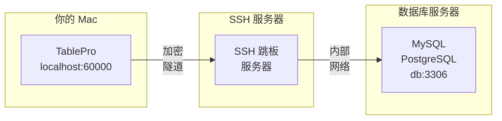
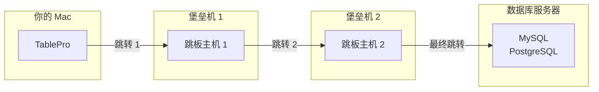

# SSH Tunneling

SSH tunneling 将你的数据库连接通过加密隧道路由，以访问无法从 Mac 直接连接的服务器。TablePro 管理 tunnel 的生命周期，包括保活和自动重连。

<Tip>
如果你通过同一台 SSH 服务器连接多个数据库，可以将 SSH 配置保存为可复用的 profile。参阅 [SSH Profiles](/zh/features/ssh-profiles)。
</Tip>

## SSH Tunneling 的工作原理



1. TablePro 向你的跳板服务器发起 SSH 连接
2. 本地端口（如 60000）通过隧道转发
3. Mac 和 SSH 服务器之间的所有流量都是加密的
4. SSH 服务器代替你连接数据库

## 何时使用 SSH Tunneling

- 数据库服务器位于私有网络中
- 数据库服务器只接受本地连接
- 需要加密数据库连接
- 需要通过堡垒机/跳板机访问数据库

## 设置 SSH Tunneling

<Steps>
  <Step title="创建或编辑连接">
    打开数据库的连接表单
  </Step>
  <Step title="启用 SSH Tunnel">
    将 **SSH Tunnel** 开关切换为 ON
  </Step>
  <Step title="配置 SSH 设置">
    输入 SSH 服务器信息和认证方式
  </Step>
  <Step title="测试并连接">
    点击 **Test Connection** 验证隧道是否正常工作
  </Step>
</Steps>

{/* Screenshot: Connection form with SSH section expanded */}
<Frame caption="SSH tunnel 配置">
  
  
</Frame>

## SSH 配置选项

### SSH 服务器设置

| 字段 | 描述 | 默认值 |
|-------|-------------|---------|
| **SSH Host** | SSH 服务器主机名或 IP | - |
| **SSH Port** | SSH 服务器端口 | `22` |
| **SSH User** | SSH 用户名 | - |

### 认证方式

TablePro 支持三种 SSH 认证方式：

<Tabs>
  <Tab title="密码">
    简单的密码认证：

    | 字段 | 描述 |
    |-------|-------------|
    | **SSH Pass** | 你的 SSH 密码 |

    <Warning>
    密码认证不如密钥认证安全。生产服务器请使用 SSH 密钥。
    </Warning>
  </Tab>
  <Tab title="私钥">
    基于密钥的认证（更安全）：

    | 字段 | 描述 |
    |-------|-------------|
    | **Key File** | 私钥路径（如 `~/.ssh/id_rsa`） |
    | **Passphrase** | 密钥口令（如果已加密） |

    <Tip>
    点击 **Browse** 选择私钥文件。TablePro 默认在 `~/.ssh/` 中查找。
    </Tip>
  </Tab>
  <Tab title="SSH Agent">
    将签名委托给 SSH agent 进程（1Password、Secretive、macOS `ssh-agent`）。密钥保留在 agent 中，TablePro 不会读取。

    | 字段 | 描述 |
    |-------|-------------|
    | **Agent Socket** | 下拉菜单，可选 `SSH_AUTH_SOCK`、`1Password` 或 `Custom Path` |

    - **SSH_AUTH_SOCK**：使用系统的 `SSH_AUTH_SOCK` 环境变量。
    - **1Password**：使用 1Password 的默认 socket 路径 `~/Library/Group Containers/2BUA8C4S2C.com.1password/t/agent.sock`。
    - **Custom Path**：显示文本框，可输入其他 agent socket 路径。

    <Tip>
    1Password 文档中也提到 `~/.1password/agent.sock` 作为更简短的别名，但该快捷方式仅在你自己创建后才有效。TablePro 的 **1Password** 选项使用 `~/Library/Group Containers/...` 中的默认路径。
    </Tip>
  </Tab>
</Tabs>

{/* Screenshot: SSH authentication methods */}
<Frame caption="SSH 认证：密码和私钥选项">
  
  
</Frame>

### 使用 SSH Config

如果你在 `~/.ssh/config` 中有配置项，TablePro 会自动读取：

1. TablePro 在启动时读取你的 SSH 配置
2. 从 **SSH Host** 下拉菜单中选择主机
3. 设置会从配置中自动填充

SSH 配置示例：

```
# ~/.ssh/config
Host production-jump
    HostName jump.example.com
    User deploy
    Port 22
    IdentityFile ~/.ssh/production_key
```

这会在 SSH Host 下拉菜单中显示为「production-jump」。

{/* Screenshot: SSH config hosts */}
<Frame caption="从 ~/.ssh/config 导入的 SSH 主机">
  
  
</Frame>

## 数据库连接设置

使用 SSH tunneling 时，数据库 host 是相对于 SSH 服务器的：

| 字段 | 值 | 描述 |
|-------|-------|-------------|
| **Host** | `localhost` 或 `127.0.0.1` | 数据库在 SSH 服务器本机上 |
| **Host** | `db.internal` | 数据库在内部网络中 |
| **Port** | `3306`、`5432` 等 | 数据库端口（不变） |

<Note>
数据库 host 应该是 SSH 服务器用来访问数据库的地址，而不是你的 Mac 使用的地址。
</Note>

### 常见场景

#### 数据库在 SSH 服务器上

数据库与 SSH 服务器运行在同一台机器上：

```
SSH Host:       jump.example.com
SSH User:       deploy

Database Host:  localhost
Database Port:  3306
```

#### 数据库在内部网络中

数据库在另一台服务器上，只能从 SSH 服务器访问：

```
SSH Host:       jump.example.com
SSH User:       deploy

Database Host:  db.internal.example.com
Database Port:  5432
```

#### 通过堡垒机访问 AWS RDS

通过 EC2 堡垒机连接 RDS：

```
SSH Host:       bastion.example.com
SSH User:       ec2-user
Key File:       ~/.ssh/aws-key.pem

Database Host:  mydb.abc123.us-east-1.rds.amazonaws.com
Database Port:  5432
```

## 多跳 SSH（ProxyJump）

当数据库服务器位于多个堡垒机之后时，TablePro 可以使用 OpenSSH 的 `-J`（ProxyJump）标志链接 SSH 跳转。单个 `ssh` 进程处理所有中间跳转。



### 设置多跳

1. 打开连接表单并切换到 **SSH Tunnel** 标签页
2. 启用 SSH 并配置**最终 SSH 服务器**（能访问数据库的那台）
3. 展开认证设置下方的 **Jump Hosts** 部分
4. 点击 **Add Jump Host** 并按顺序填写每个中间堡垒机
5. 主机按顺序连接：第一个跳板主机从你的 Mac 访问，每个后续主机通过前一个访问

### Jump Host 设置

每个 jump host 有以下配置：

| 字段 | 描述 |
|-------|-------------|
| **Host** | 跳板主机的主机名或 IP |
| **Port** | SSH 端口（默认 `22`） |
| **Username** | 此跳转的 SSH 用户名 |
| **Auth Method** | **Private Key** 或 **SSH Agent**（jump host 不支持密码认证） |
| **Key File** | 私钥路径（使用 Private Key 认证时） |

### 示例：两个堡垒机

```
Jump Host 1:    admin@bastion1.example.com:22    (SSH Agent)
Jump Host 2:    tunnel@bastion2.internal:2222     (Private Key)

SSH Server:     deploy@final-ssh.internal:22
Database Host:  db.internal:5432
```

这等效于：
```bash
ssh -J admin@bastion1.example.com:22,tunnel@bastion2.internal:2222 deploy@final-ssh.internal
```

### SSH Config 集成

TablePro 读取 `~/.ssh/config` 中的 `ProxyJump` 指令。当你选择设置了 `ProxyJump` 的配置主机时，jump host 会自动填充。

```
# ~/.ssh/config
Host production-db
    HostName final-ssh.internal
    User deploy
    ProxyJump admin@bastion1.example.com,tunnel@bastion2.internal:2222
```

<Note>
Jump host 仅支持 **Private Key** 和 **SSH Agent** 认证。不支持中间跳转的密码认证，因为 OpenSSH 的 `-J` 标志不支持 jump host 的交互式密码提示。
</Note>

## SSH 密钥设置

### 生成 SSH 密钥

如果你没有 SSH 密钥：

```bash
# 生成新的密钥对
ssh-keygen -t ed25519 -C "your_email@example.com"

# 或使用 RSA 以获得更广泛的兼容性
ssh-keygen -t rsa -b 4096 -C "your_email@example.com"
```

### 密钥位置

macOS 上的默认密钥位置：

| 密钥类型 | 私钥 | 公钥 |
|----------|-------------|------------|
| Ed25519 | `~/.ssh/id_ed25519` | `~/.ssh/id_ed25519.pub` |
| RSA | `~/.ssh/id_rsa` | `~/.ssh/id_rsa.pub` |
| ECDSA | `~/.ssh/id_ecdsa` | `~/.ssh/id_ecdsa.pub` |

### 将密钥添加到服务器

将公钥复制到 SSH 服务器：

```bash
# 使用 ssh-copy-id
ssh-copy-id -i ~/.ssh/id_ed25519.pub user@server

# 或手动操作
cat ~/.ssh/id_ed25519.pub | ssh user@server "mkdir -p ~/.ssh && cat >> ~/.ssh/authorized_keys"
```

### 密钥权限

SSH 密钥必须有正确的权限：

```bash
# 修复权限
chmod 700 ~/.ssh
chmod 600 ~/.ssh/id_*
chmod 644 ~/.ssh/id_*.pub
chmod 644 ~/.ssh/config
```

## 从 URL 导入

通过 URL 导入 SSH tunnel 连接，无需逐个填写字段。TablePro 支持 `+ssh` URL scheme，将 SSH 和数据库凭据编码在同一个字符串中。

完整的 URL 规范请参阅 [连接 URL 参考](/zh/databases/connection-urls#ssh-tunnel-格式)。

**格式：**

```
scheme+ssh://ssh_user@ssh_host:ssh_port/db_user:db_password@db_host/db_name?name=MyConnection&usePrivateKey=true
```

**支持的 scheme：** `mysql+ssh`、`postgresql+ssh`、`postgres+ssh`、`mariadb+ssh`

**示例：**

```
mysql+ssh://root@123.123.123.123:1234/database_user:database_password@127.0.0.1/database_name?name=FlashPanel&usePrivateKey=true
```

这会填充：
- **SSH Host**：`123.123.123.123`，**SSH Port**：`1234`，**SSH User**：`root`
- **Database Host**：`127.0.0.1`，**Database User**：`database_user`，**Database**：`database_name`
- **Connection Name**：`FlashPanel`，**Auth Method**：Private Key

**查询参数：**

| 参数 | 描述 |
|-----------|-------------|
| `name` | 设置连接名称 |
| `usePrivateKey` | 设为 `true` 选择 Private Key 认证 |
| `useSSHAgent` | 设为 `true` 选择 SSH Agent 认证 |
| `agentSocket` | 可选的 SSH agent socket 路径覆盖（例如 `~/Library/Group Containers/2BUA8C4S2C.com.1password/t/agent.sock`） |

导入方法：打开 **New Connection**，点击 **Import from URL**，然后粘贴 URL。

<Tip>
此格式与 TablePlus SSH 连接 URL 兼容，因此迁移时可以直接粘贴 URL。
</Tip>

## 故障排除

### 连接被拒绝

**症状**：测试 SSH tunnel 时 "Connection refused"

**原因及解决方案**：

1. **SSH 服务器未运行**
   ```bash
   # 直接测试 SSH 连接
   ssh -v user@server
   ```

2. **端口错误**
   - 验证 SSH 端口（某些服务器使用非标准端口）
   - 向服务器管理员确认

3. **防火墙阻止连接**
   - 确保端口 22（或自定义端口）已开放
   - 检查本地和服务器的防火墙

### 认证失败

**症状**："SSH authentication failed" 或 "Permission denied"

**密码认证**：
1. 验证用户名和密码
2. 检查服务器是否启用了密码认证
3. 尝试通过终端连接：`ssh user@server`

**密钥认证**：
1. 验证密钥文件路径正确
2. 检查密钥权限（`chmod 600`）
3. 确保公钥在服务器的 `authorized_keys` 中
4. 验证口令（如果密钥已加密）
5. 尝试通过终端连接：
   ```bash
   ssh -i ~/.ssh/your_key user@server
   ```

### 私钥错误

**"Private key file not found"**：
- 验证路径是否存在
- 使用 Browse 按钮选择文件

**"Private key file is not readable"**：
```bash
chmod 600 ~/.ssh/your_key
```

**"Wrong passphrase"**：
- 重新输入口令
- 手动测试密钥：`ssh-keygen -y -f ~/.ssh/your_key`

### Tunnel 已建立但数据库连接失败

如果 SSH tunnel 连接成功但数据库连接失败：

1. **验证数据库 host 正确**（相对于 SSH 服务器）
   ```bash
   # 从 SSH 服务器测试数据库连接
   ssh user@server "mysql -h localhost -u dbuser -p"
   ```

2. **检查数据库端口**
   - 确保端口与数据库服务器的实际端口匹配

3. **验证数据库凭据**
   - 用户名/密码可能与 SSH 凭据不同

### Tunnel 定期断开

TablePro 使用保活设置维护隧道：

- `ServerAliveInterval=60`：每 60 秒发送保活信号
- `ServerAliveCountMax=3`：3 次未响应后断开

如果隧道仍然断开：
1. 检查网络稳定性
2. 验证服务器的 `ClientAliveInterval` 设置
3. 检查防火墙的空闲超时设置

{/* Screenshot: SSH tunnel active */}
<Frame caption="活跃的 SSH tunnel 状态指示器">
  
  
</Frame>

## 安全注意事项

### 最佳实践

1. **使用密钥认证** 而非密码
2. **使用 Ed25519 或 4096 位以上的 RSA 密钥**
3. **用口令保护私钥**
4. **限制 SSH 访问** 到特定的用户/IP
5. **使用专用跳板机** 而非直接访问数据库

### 加密范围

| 数据 | 是否加密 |
|------|-----------|
| SSH 连接 | 是 |
| 数据库凭据 | 是（通过隧道） |
| 查询数据 | 是（通过隧道） |
| 本地存储的密码 | 是（macOS Keychain） |

### 应避免的做法

- 不要共享私钥
- 不要在生产服务器上使用密码认证
- 不要以明文存储 SSH 密码
- 不要将数据库端口直接暴露到互联网

## SSH Agent 认证

使用 SSH Agent 认证时，你的私钥不会离开 agent 进程。1Password、Secretive 或内置的 macOS `ssh-agent` 持有密钥，代表 TablePro 进行签名。

### 设置

1. 选择 **SSH Agent** 作为认证方式
2. 从下拉菜单中选择 **Agent Socket** 选项
3. 选择 **SSH_AUTH_SOCK** 使用系统默认值
4. 选择 **1Password** 使用 `~/Library/Group Containers/2BUA8C4S2C.com.1password/t/agent.sock`
5. 选择 **Custom Path** 手动输入其他 socket 路径

### 验证 Agent

确认 agent 已加载密钥：

```bash
# 列出 agent 中的密钥
ssh-add -l

# 如果为空，添加密钥
ssh-add ~/.ssh/id_ed25519
```

### Agent Socket 选项

| 选项 | 行为 |
|--------|----------|
| `SSH_AUTH_SOCK` | 使用当前的 `SSH_AUTH_SOCK` 环境变量 |
| `1Password` | 使用 `~/Library/Group Containers/2BUA8C4S2C.com.1password/t/agent.sock` |
| `Custom Path` | 允许输入其他 socket 路径，例如 Secretive 偏好设置中显示的路径 |

## 后续步骤

<CardGroup cols={2}>
  <Card title="MySQL 连接" icon="database" href="/zh/databases/mysql">
    MySQL 特有的设置和功能
  </Card>
  <Card title="PostgreSQL 连接" icon="database" href="/zh/databases/postgresql">
    PostgreSQL 特有的设置和功能
  </Card>
  <Card title="连接管理" icon="plug" href="/zh/databases/overview">
    管理所有连接
  </Card>
  <Card title="键盘快捷键" icon="keyboard" href="/zh/features/keyboard-shortcuts">
    加速你的工作流程
  </Card>
</CardGroup>
